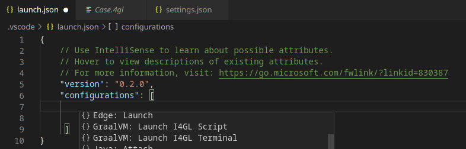
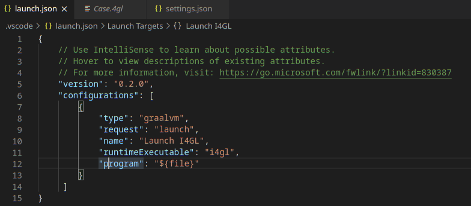
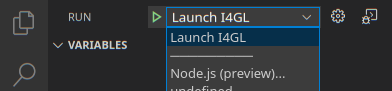
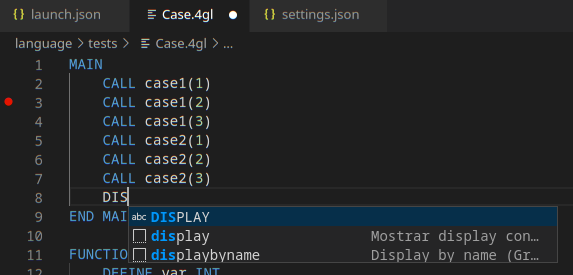
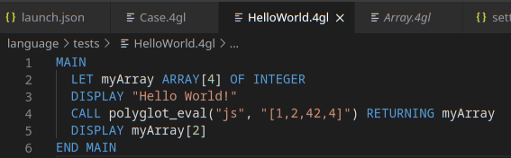

# GraalVM I4GL Support for VS Code

A VS Code extension providing the basic support for editing and debugging I4GL programs running on [GraalVM I4GL](http://www.graalvm.org/docs/reference-manual/languages/i4gl).
The extension is Technology Preview.

Syntax higlight based on the extension [I4GL](https://marketplace.visualstudio.com/items?itemName=CristianRengifo.informix4gl), the source code is hosted at [github](https://github.com/INGCRENGIFO/VsCodeInformix4GL.git).
## Features

### I4GL Debugging

To debug a I4GL application running on GraalVM, creating a launch configuration for the application is necessary. To do so, open the applicarion project folder in VS Code (File > Open Folder) and then select the Configure gear icon on the Debug view top bar. If debugging is not yet configured (no `launch.json` has been created), select `GraalVM` from the list of available debug environmnets. Once the `launch.json` file is opened in the editor, one of the following techniques can be used to add a new configuration:
* Use IntelliSense if your cursor is located inside the configurations array.
* Press the Add Configuration button to invoke snippet IntelliSense at the start of the array.
* Choose Add Configuration option in the Debug menu.

The GraalVM Pyton extension provides the following debug configuration that can be used to debug a I4GL applications/scripts running on GraalVM:
* __Launch I4GL Script__ - Launches a I4GL script using GraalVM in a debug mode.

When editing debug configurations, you can use IntelliSense suggestions (Ctrl+Space) to find out which attributes exist for a specific debug configuration. Hover help is also available for all attributes.

In order to start a debug session, first select the proper configuration using the Configuration drop-down in the Debug view. Once you have your launch configuration set, start your debug session with F5. Alternatively you can run your configuration through the Command Palette (Ctrl+Shift+P), by filtering on Debug: Select and Start Debugging or typing 'debug ', and selecting the configuration you want to debug.

### Additional Editor Features

Since an easy writing of [polyglot](https://www.graalvm.org/docs/reference-manual/polyglot) applications is one of the defining features of GraalVM, the code completion invoked inside I4GL sources provides items for `polyglot_eval(...)`, `polyglot_eval_file(...)` and `java_type(...)` calls.

For I4GL sources opened in editor, all the `polyglot_eval(...)` calls are detected and the respective embedded languages are injected to their locations. For example, having a JavaScript code snippet called via the Polyglot API from inside a I4GL source, the JavaScript language code is embedded inside the corresponding I4GL string and all VS Code's editing features (syntax highlighting, bracket matching, auto closing pairs, code completion, etc.) treat the content of the string as the JavaScript source code.

## Extension Settings

This extension contributes the following settings:

* __graalvm.i4gl.home__ - Path to GraalVM I4GL installation.

## Requirements

This extension depends on the following extensions:
* [GraalVM](https://marketplace.visualstudio.com/items?itemName=oracle-labs-graalvm.graalvm) - Support for GraalVM.
